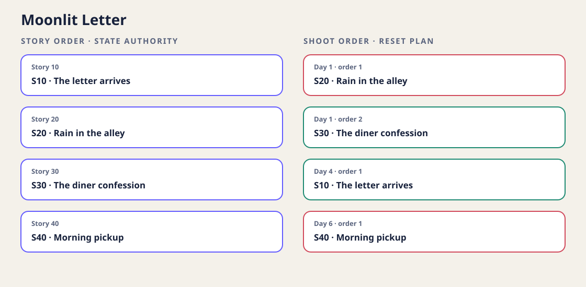

# StateSlate

**把故事连续性编译成拍摄日复位清单。**

[English](README.md) · [生成报告](docs/demo/report.html) ·
[输入格式](docs/FORMAT.md) · [故障修复](docs/REPAIR.md)



StateSlate 是一个离线、零运行时依赖的连续性编译器，面向小型电影、短片、
广告与摄影制作。你提供已经人工确认的连续性对象、故事顺序、拍摄顺序和明确
状态变化；它先按故事顺序传播状态，再生成拍摄时要准备什么、从上一次拍摄状态
复位什么，以及哪些参考画面因为前序故事场景尚未拍摄而暂时不存在。

它不是素材库、排期软件或 AI 猜测器；不会上传制作数据、解析剧本、判断照片，
也不声称某个现场布置真的正确。

## 一分钟验证

需要 Python 3.11 或更高版本。从
[最新 Release](https://github.com/KanadeK/stateslate/releases/latest)
下载 wheel 后执行：

```console
python -m pip install stateslate-0.1.0-py3-none-any.whl
stateslate demo --out moonlit-letter-report
```

命令会生成且只生成五个文件：

```text
continuity.json       机器可读的完整证据
shoot-plan.csv        可安全打开的逐场逐轨表格
reset-checklist.md    按拍摄顺序执行的复位清单
timeline.svg          故事/拍摄双顺序对照图
report.html           无脚本、单文件离线报告
```

内置示例包含 4 场戏、3 条连续性轨道、3 次首次准备、3 次复位、2 个高风险和
2 个中风险。也可以直接编译公开示例：

```console
stateslate compile examples/moonlit-letter.json --out report
```

## 核心模型

连续性以故事顺序为唯一权威。`initial` 是最初状态；每场戏的 `expects` 验证
入场状态；`transitions` 用显式 `from → to` 描述场内变化。编译成功后，
StateSlate 才把这些已证明的状态投影到拍摄顺序，并计算：

- 某条轨道首次拍摄时要准备的状态；
- 与该轨道上一次实际拍摄状态之间的复位差异；
- 上一个故事场景是否已经拍摄，可否作为现场参考；
- 已有参考跨越的拍摄日间隔是否达到审查阈值。

v0.1 的状态值故意限定为短字符串。如果“外套是否湿”和“纽扣是否扣好”需要
独立跟踪，就声明两条轨道，不要让工具猜测复合状态。完整格式见
[docs/FORMAT.md](docs/FORMAT.md)。

## 退出码

| 退出码 | 含义 | 产物 |
| --- | --- | --- |
| `0` | 输入有效，所选风险门禁通过 | `compile`/`demo` 生成报告 |
| `1` | 编译有效，但触发 `--fail-on` 风险阈值 | 保留报告作为证据 |
| `2` | 输入、输出路径、I/O 或命令用法错误 | 不创建报告目录 |

已有的 `--out` 会被拒绝，StateSlate 不会合并或覆盖用户文件。修复方法见
[docs/REPAIR.md](docs/REPAIR.md)。

## 明确边界

StateSlate 能证明“声明的数据内部一致、五份报告来自同一个编译模型”；不能证明
标签本身真实、服化道已经按清单复位、照片视觉一致或现场确实执行。制作团队仍然
是现实连续性的权威。

v0.1 不做剧本解析、OCR/AI 推断、照片存储/对比、排期优化、账号、协作、云同步
或安全/艺术决策。输入上限为 2 MiB UTF-8 JSON、500 条轨道、1,000 场戏和
10,000 条状态变化。

## 开发验收

```console
git clone https://github.com/KanadeK/stateslate.git
cd stateslate
uv sync --locked --all-groups
uv run --no-sync python scripts/check.py
```

完整门禁包含格式、Ruff、严格 mypy、分支覆盖率、示例、失败路径、依赖审计、
wheel/sdist 构建、隔离安装和已安装命令行验收。
